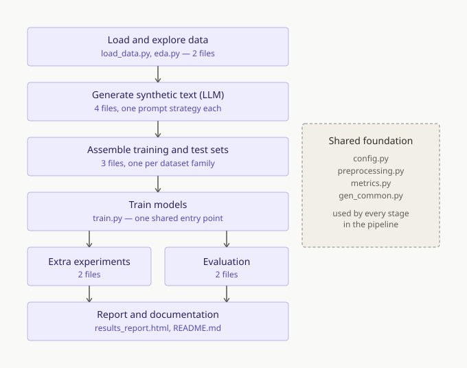

# FYP: Fake News Detection via LLM-Generated Synthetic Data

Implementation of the methodology in Chapter 3. Trains three model families
(LR/SVM, CNN, BERT) under three data compositions and evaluates cross-domain
generalization (train on ISOT, test on LIAR).

## Pipeline structure

`src/` has 32 Python files, but they're grouped into 6 sequential stages plus a
shared foundation, not scattered:



Every filename is prefixed by its job (`build_*`, `generate_*`, `run_*`,
`eval*`) so this grouping is visible directly in a file listing, without
needing the diagram. Each file does exactly one thing — one dataset variant,
one generation strategy, one experiment — which is why there are many of
them rather than a few large multi-purpose scripts; see "so many files in `src/`
— why not fewer?" in `DEFENSE_PREP.md` for the full reasoning.

## Research question map

The proposal states four objectives. `results_report.html`'s section labels
now follow this numbering directly (each section's eyebrow names which
objective it answers), plus one addition that isn't one of the four:

| Proposal objective | Answered by | How |
|---|---|---|
| 1. Generate synthetic fake news from diverse real-world sources, and evaluate whether it can serve as a primary training resource when real fake news is limited | **"Objective 1 · Diverse sources"**, **"Objective 1 · Full replacement"**, **"Objective 1 · Partial augmentation"** (three sections, one objective) | Diverse sources: `generate_synthetic_fake_liar.py` + `build_multisource_dataset.py` add a second, LIAR-sourced batch, since the original generation was ISOT-only. Full replacement: removes real fake news from training entirely. Partial augmentation: keeps real fake news and adds synthetic on top instead. |
| 2. Examine cross-domain generalization performance of synthetic data across multiple datasets | **"Objective 2 · Cross-domain generalization"**, and threaded through every other section | Every composition is evaluated train-ISOT / test-LIAR (`test_crossdomain.csv`) *and* test-WELFake (`test_crossdomain2.csv`) as a second, independent dataset, to confirm results aren't one dataset's quirk |
| 3. Compare robustness across model families (traditional ML, deep learning, transformers) | Not a separate section -- how every section is run | LR/SVM/CNN/BERT are trained and evaluated identically for every composition, via `metrics.py`'s shared `compute_metrics()`, so the comparison is built into every chart rather than living in one place |
| 4. Analyze whether style-diverse synthetic fake news enhances resistance to stylistic manipulation and sentiment-based attacks | **"Objective 4 · Style robustness"** | Style-attack test set (`generate_style_attack.py`) + the `style_robust` training fix (`generate_counter_style_training.py`/`build_style_robust_dataset.py`) |
| *(not one of the 4)* | **"Beyond the proposal · Validity check"** (the authorship-shortcut section) | Rules out "the model just detects AI-authorship" as an alternative explanation for Objective 1's results, via synthetic-*real* news controls (C0-C3) |

The validity check is the one addition beyond the four objectives -- worth
naming explicitly as an added rigor check in the methodology chapter, not
presented as if it were a fifth objective from the start.

## Hardware target
- RTX 4060 (8GB VRAM), local Windows/Linux
- BERT-base + CNN both fit comfortably in 8GB at the batch sizes in config.py

## Setup

```bash
# 1. Create a virtual environment
python -m venv venv
# Windows:  venv\Scripts\activate
# Linux:    source venv/bin/activate

# 2. Install PyTorch with CUDA (check https://pytorch.org for your CUDA version)
pip install torch --index-url https://download.pytorch.org/whl/cu121

# 3. Install everything else
pip install -r requirements.txt

# 4. Set your OpenAI key (for synthetic generation only)
# Windows:  set OPENAI_API_KEY=sk-...
# Linux:    export OPENAI_API_KEY=sk-...
# Never commit .env or share it -- it holds your real API key.
```

## Data download (manual)
Put these in `data/raw/`:
- **ISOT**: `True.csv` and `Fake.csv` from
  https://www.uvic.ca/ecs/ece/isot/datasets/fake-news/index.php
  (or the Kaggle mirror "ISOT Fake News Dataset")
- **LIAR**: `train.tsv`, `test.tsv`, `valid.tsv` from
  https://huggingface.co/datasets/liar  (or the original UCSB release)

## Run order (each step depends on the previous)

```bash
# --- Core pipeline (required) ---
python src/load_data.py        # load + normalize labels -> data/processed/
python src/eda.py              # exploratory analysis -> results/eda/
python src/generate_synthetic_fake.py --n 500     # OpenAI: synthetic FAKE (ISOT-sourced) -> data/synthetic/
python src/generate_synthetic_real.py --n 1000    # OpenAI: synthetic REAL (paraphrase-only control, optional)
python src/build_core_datasets.py       # assemble real_real/mixed/real_syn (Objective 1: full replacement)
python src/build_augmented_datasets.py  # augmented / lowres_real / lowres_aug (Objective 1: partial augmentation)
python src/build_test_sets.py           # test_indomain vs test_crossdomain (separated!)
python src/evaluate.py leakage          # VERIFY: no train text in any test set + how independent each test corpus really is
python src/build_synthetic_real_datasets.py  # C2/C3 (needs generate_synthetic_real.py run first, optional -- validity check)
python src/train.py --model all   # LR+SVM+CNN+BERT (replacement, on test_crossdomain)
python src/evaluate.py master     # gather train.py's metrics into master_results.csv
python src/run_train_extra_experiments.py   # LR/SVM on augmented/lowres, test_indomain + test_crossdomain
python src/run_deep_extra_experiments.py --models cnn bert  # CNN/BERT on augmented/lowres, both test sets

# --- Contamination control: WELFake is not the independent corpus it looks like ---
# 63.3% of WELFake's fake class is verbatim ISOT text, because WELFake is a merged
# corpus that absorbed the same Kaggle data ISOT derives from. build_test_sets.py
# therefore also writes test_crossdomain2_clean.csv, which drops every ISOT article
# (and WELFake's own internal duplicates) before sampling -- verified 0.0% overlap.
# Both sets are kept and scored: the gap between them measures what the
# contamination was actually worth, instead of asserting that it didn't matter.
python src/evaluate.py cross-target --dataset welfake --comp real_real mixed real_syn c2_synreal_realfake c3_synreal_synfake
python src/evaluate.py cross-target --dataset welfake_clean --comp real_real mixed real_syn c2_synreal_realfake c3_synreal_synfake
# Inference only -- no retraining, since a model's weights don't depend on which
# test set you later score it against.

# --- Length-confound control: mixed-length synthetic fakes (needs OpenAI credit) ---
# The default generator applies one edit and leaves the rest of the wording alone,
# so synthetic fakes inherit the source's length (median 376 words vs 369 for ISOT
# real). That lets a classifier separate the training classes on length-correlated
# cues. --lengths regenerates the same fact-manipulations at ~25 / ~100 / ~400 words
# over DISJOINT source articles, breaking the length-label correlation without
# changing what makes the text false. Writes a separate file; synthetic_fake.csv
# and every result derived from it are left untouched.
python src/generate_synthetic_fake.py --n 500 --lengths short medium long
python src/build_core_datasets.py         # also writes train_real_syn_mixedlen.csv
python src/train.py --model all --dataset real_syn_mixedlen
python src/evaluate.py cross-target --dataset welfake_clean --comp real_syn real_syn_mixedlen
# The recipe is an ADDITION, not a replacement: real_syn and real_syn_mixedlen
# differ in exactly one variable, so the PAIR is what carries the finding.
# Both classes are cut to the same targets -- swapping mixed-length fakes in
# against full-length reals would make "short => fake" a free win on two thirds
# of the fake class, a worse confound than the one being removed.
# `evaluate.py leakage` section 4 reports why this matters: test_crossdomain
# (LIAR) is separable at AUC 0.9999 by document length ALONE, so a score there
# is not by itself evidence a model learned anything about truth.

# --- Statistical validation (no retraining, no GPU) ---
# McNemar's test on paired predictions: is a score gap bigger than chance? Loads
# saved checkpoints and runs inference only, caching each (model, composition)
# once however many pairwise comparisons use it. Two axes: same model across
# recipes, and same recipe across models.
python src/evaluate.py significance --dataset liar
python src/evaluate.py significance --dataset welfake_clean
# With ~10,000 paired rows nearly everything clears p<0.05, so the NULL results
# are the informative ones. Holm-Bonferroni columns are included and are what to
# quote -- 96 tests in one family will throw a false positive otherwise.

# --- 5-fold cross-validation, LR/SVM only ---
# CNN and BERT are deliberately excluded: five folds would mean five extra neural
# training runs per composition, and their run-to-run variance is already
# measured by run_multiseed_robustness.py at a fraction of the GPU cost. LR and
# SVM are deterministic, so the seed runs report exactly zero spread for them --
# CV is the only variance estimate they can have.
python src/train.py --model lr_svm --cv 5 --dataset real_real mixed real_syn style_robust
# IMPORTANT -- these scores are IN-DISTRIBUTION (80/20 within one composition),
# not cross-domain. Do not put them in the same table as the LIAR/WELFake numbers.
# Two splits are reported, and the difference between them is a finding: the
# synthetic recipes are minimal PAIRS (an article, and its one-fact-altered
# twin), so an ordinary k-fold puts one half of a pair in train and the other in
# validation. The model memorises the article as real and calls its fake twin
# real too -- LR on real_syn scores AUC 0.028 that way, against 0.568 when pairs
# are kept whole. The pair-aware (StratifiedGroupKFold) figure is the valid one.

# --- Objective 1 follow-up: balance-controlled synthetic-fraction sweep (recommended read for the augmentation angle) ---
python src/build_swap_sweep_datasets.py   # 0/25/50/75/100% synthetic, fake count fixed at 500
python src/run_swap_sweep_experiment.py   # trains + evaluates all 4 models at each fraction

# --- RQ3 fairness control: do the four models read the same amount of text? ---
# TF-IDF has no length limit (LR/SVM read the whole article) while BERT stops at
# 512 tokens and CNN at 300, and 64.5% of training articles exceed 300 words.
# --max-words caps every train AND test document identically, writing results
# under a separate '<comp>_max<N>' label so the full-text runs are untouched.
python src/train.py --model lr_svm --dataset real_real mixed real_syn --max-words 300
python src/train.py --model cnn bert --dataset real_real mixed real_syn --max-words 300
# build_report.py pairs metrics_<MODEL>_<comp>.json with the _max300 counterpart
# directly -- there is no intermediate file to regenerate.

# --- Reliability check: is a single CNN/BERT run trustworthy? ---
python src/run_multiseed_robustness.py    # 3 seeds x 5 compositions, CNN + BERT only
                                          # (LR/SVM are deterministic given fixed data)

# --- Objective 4: style/sentiment robustness ---
python src/generate_style_attack.py --n 200           # TEST-side attack: 100 real->sensationalized, 100 fake->neutralized
python src/eval_style_robustness.py                    # evaluate already-trained models, no retraining
python src/generate_counter_style_training.py          # TRAINING-side fix: 100+100 paired counter-style twins
python src/build_style_robust_dataset.py               # train_real_real + those pairs = train_style_robust (600/600)
python src/train.py --model all --dataset style_robust  # trains all 4 models on it, evaluates on test_crossdomain
# then re-run eval_style_robustness.py -- it includes style_robust in its COMPS list

# --- Objective 1 fix: synthetic fake news from a SECOND source, not ISOT alone ---
python src/generate_synthetic_fake_liar.py --n 200  # OpenAI: synthetic FAKE sourced from LIAR-real statements
python src/build_multisource_dataset.py             # combines with ISOT-sourced synthetic -> train_real_syn_multisource
python src/train.py --model all --dataset multisource      # trains all 4 models on it, evaluates on test_crossdomain

# --- Build the report (run after ANY experiment that changes results/) ---
python src/export_detector_model.py   # dump the real_real LR weights for the browser demo
python src/build_report.py            # regenerate results_report.html from results/ + the template
# results_report.html is GENERATED -- edit src/report_template.html, not the output.

# --- View everything ---
# open results_report.html in a browser -- static report, all numbers are baked in, no data files needed to view it
```

`generate_synthetic_real.py` and `build_synthetic_real_datasets.py` are optional
controls for the validity check (see below) — everything else through
`run_deep_extra_experiments.py` is required for the core replacement + augmentation
experiments. The scripts after that (the swap-sweep, multiseed, and
style-attack/reverse-attack scripts) are later additions that close out
Objectives 4 and 1 respectively — see below for what each answers.

## The experiment matrix

This project's 4 objectives, plus one addition, get asked here; keep them
separate when writing up — they use different training-set pairs (the style
objective's evaluation also uses a dedicated style-attacked test set, built by
`generate_style_attack.py`, rather than `test_crossdomain`/`test_indomain`).
Labeling matches `results_report.html`'s section eyebrows directly (each names
its objective number). Objectives 1 and 2's sections are all evaluated on
`test_crossdomain.csv` unless stated otherwise; see "Evaluation setup note"
below for how that compares against `test_indomain.csv`.

**Evaluation setup note — in-domain vs cross-domain test sets** (built by
`build_test_sets.py`): `test_indomain` = ISOT real (held-out) + ISOT
fake (held-out) — everything same-source as training. `test_crossdomain` =
ISOT real (held-out) + LIAR fake — fake-class source changed, real-class
source unchanged. "Domain" here is defined by the FAKE-class source only; the
real-class half of both test sets is identical. **Important caveat, confirmed
during the Objective 1 multi-source work**: LIAR is short political
statements (~17 words median) vs ISOT's full articles (~380 words median) —
a large length/genre difference, not just a topic difference. This means
`test_crossdomain` partially confounds "genre/length shift" with "domain
shift": a model can score well by partly keying on article length rather
than content. Re-evaluating a model on `test_indomain` (no length difference
between classes) is the way to check how much of a `test_crossdomain` score
is length-driven — see the "Does the detector still work on fake news from
a totally different source?" section in `results_report.html` for the
LIAR-vs-WELFake comparison that disentangles genre/length shift from domain
shift (LR/CNN/BERT all show a real, but moderate, drop in-domain —
confirming a genuine but partial confound, not a total illusion). State
this caveat explicitly in your write-up rather than
calling `test_crossdomain` a clean topic-domain generalization test.

**Objective 1 — Full replacement**: does swapping the SOURCE of fake-class training examples
(holding total fake count fixed) change detection performance?

| Name        | Real news | Fake news              | Fake count |
|-------------|-----------|-------------------------|------------|
| `real_real` (C0) | ISOT real | ISOT real-fake     | capped to match synthetic supply |
| `mixed`          | ISOT real | 50% real-fake + 50% synthetic | same as above |
| `real_syn` (C1)  | ISOT real | synthetic only     | same as above |

All three are built with the SAME fake-class total (`build_core_datasets.py`
caps every composition at `min(real_train, isot_fake_pool, len(synthetic))` —
previously `real_syn` silently got half the fake count of the other two; now
fixed). Tested on `test_crossdomain.csv` (ISOT real held-out + LIAR fake).

**What `real_syn`'s SVM collapse (F1=0.000) actually looks like at the example
level** (`evaluate.py hard-examples --model svm --comp real_syn`): every single
prediction on both LIAR and WELFake fake articles comes back with confidence
*exactly* 0.500 — not "wrong but uncertain," but zero differentiation at all,
consistent with the AUC=0.500 (pure chance) already reported. Contrast with
`real_real`'s SVM, which only misclassifies 462/9941 WELFake articles, and even
those are wire-style articles that genuinely read like real news on the
surface (Reuters-style datelines on plausible political stories) — a
qualitatively different, much narrower failure mode than `real_syn`'s total
absence of signal. See `results/extra/hard_examples.csv` for the saved examples.

**Objective 1 — Partial augmentation**: does ADDING synthetic fake news on top of a FIXED
real-fake baseline help, hurt, or do nothing?

| Pair | What it isolates |
|------|-------------------|
| `train_real_real` vs `train_augmented` | small-scale (fake count = synthetic supply, ~475): adds synthetic on top without changing real-fake count |
| `train_lowres_real` vs `train_lowres_aug` | same idea at a fixed 1,000 real-fake baseline |
| `train_augmented_full` | NOT a controlled pair — full ISOT real-fake pool + synthetic on top. Report separately; do not compare its F1 directly to `train_real_real`. |

Report the two controlled pairs (`real_real`/`augmented` and
`lowres_real`/`lowres_aug`) as the answer to this angle — but the **recommended**
read is the balance-controlled sweep (`build_swap_sweep_datasets.py`/`run_swap_sweep_experiment.py`): both additive pairs above
still let the fake class outgrow the real class, which collapses LR/SVM/BERT
to an "always predict fake" pattern under cross-domain shift (see
`evaluate.py error-analysis`). The sweep instead holds the fake class fixed at 500
throughout and only varies what FRACTION of it is synthetic (0/25/50/75/
100%), isolating "does synthetic content help" from "does the added
imbalance hurt." Once that confound is removed, a moderate blend (~25-50%)
genuinely helps LR/SVM/BERT and is neutral-to-mildly-negative for CNN.

**Why CNN is the outlier** (`evaluate.py hard-examples --model cnn --comp
swap_025 mixed swap_075 real_syn`): unlike LR/SVM/BERT, CNN never shows a
rise-then-fall sweet spot — it declines steadily at every synthetic fraction.
Reading the actual misclassified LIAR-test examples across all four sweep
points shows why: every single error, at every synthetic fraction, is the
SAME type — a genuine ISOT real article predicted fake, never the reverse.
The exact same specific articles (colorful, commentary/opinion-flavored
genuine pieces, e.g. celebrity- or personality-driven stories, not straight
wire reports) reappear as top errors across multiple sweep points, and CNN's
confidence on these errors actually *drops* as synthetic fraction rises
(0.96 -> 0.63 average top-3 confidence from swap_025 to real_syn). That's
consistent with a general erosion of CNN's real/fake decision boundary on
stylistically distinctive real content as more synthetic (near-verbatim,
lightly-edited) fake examples enter training — not CNN learning a new,
confident-but-wrong shortcut the way SVM does on `real_syn`. See
`results/extra/hard_examples.csv`.

**Validity check (beyond the proposal) — Synthetic-real, authorship-shortcut control**: `generate_synthetic_real.py`
generates paraphrase-only (fact-preserving) rewrites of real news, giving two
more compositions that isolate whether the model is detecting "is this
LLM-authored" rather than "is this fake":

| | real-fake (RF) | synthetic-fake (SF) |
|---|---|---|
| real-real (RR) | C0 = `real_real` | C1 = `real_syn` |
| synthetic-real (SR) | C2 = `train_c2_synreal_realfake` | C3 = `train_c3_synreal_synfake` |

If C3 (both classes machine-authored) collapses to near-chance while C2 (only
the real side is machine-authored) does not, that's evidence of an
authorship-detection shortcut rather than genuine content-based detection.
Requires running `generate_synthetic_real.py` (costs OpenAI API calls) then `build_synthetic_real_datasets.py`.

**C3 doesn't collapse to chance — it's actively INVERTED, and now explained.**
C3's AUC-ROC isn't ~0.5 (no signal); it's consistently far below 0.5 across
every model, both test sets, and all 3 seeds (`train.py --model all --dataset
c2_synreal_realfake c3_synreal_synfake`, then `evaluate.py cross-target
--dataset welfake --comp c2_synreal_realfake c3_synreal_synfake`, then
`run_multiseed_robustness.py`): BERT crossdomain AUC = 0.017 +/- 0.005 (LIAR)
and 0.206 (WELFake); CNN 0.033 +/- 0.004 (LIAR) and 0.053 (WELFake) — tiny
variance, so this is a stable, reproducible property, not one bad run. It
even shows up **in-domain** (BERT AUC 0.204, CNN AUC 0.063 on `test_indomain`
— same-source ISOT data, no cross-domain shift at all), which rules out
"doesn't generalize" as the explanation entirely.

The mechanism, confirmed by reading the actual misclassified examples
(`evaluate.py hard-examples --comp c3_synreal_synfake`, both BERT and LR
independently show the identical pattern): C3's REAL class is
`generate_synthetic_real.py`'s output — real ISOT articles **paraphrased**
by an LLM. C3's FAKE class (`generate_synthetic_fake.py`) is built to **preserve
the original wording almost verbatim**, changing only one fact. So during
training, the model never once sees genuine, unedited wire-service text
labeled REAL — every REAL example it saw was already LLM-paraphrased, while
every FAKE example was near-original phrasing. At test time, when it sees
*actual* unedited real articles (which is what every held-out real-class test
example naturally is), that text is stylistically closer to what looked like
FAKE during training than what looked like REAL — so the model confidently
(BERT: 99.8%; LR: 92-94%) calls genuine Reuters wire articles fake. This is a
sharper, more specific version of the "authorship shortcut" this experiment
was built to detect: not just "detects AI-authorship in general," but
specifically "learned that unedited original phrasing predicts FAKE," which
is backwards precisely because of how the two synthetic-generation methods
differ in how much they alter the source wording. See
`results/extra/hard_examples.csv` for the saved examples from both models.

**Objective 4 — Style/sentiment robustness**: does style-diverse synthetic training
resist stylistic manipulation? Answered in two stages:

1. `generate_style_attack.py` builds a paired TEST set — 200 held-out ISOT
   articles rewritten by an LLM, tone ONLY, true label unchanged (real ->
   sensationalized, fake -> neutralized). `eval_style_robustness.py`
   evaluates the already-trained `real_real`/`mixed`/`real_syn` models
   (no retraining) on original vs. attacked versions of the same articles,
   reporting **flip rate**: of articles originally correct, the fraction
   that become wrong after the attack. Result: `mixed` (generic synthetic
   fake news) is MORE vulnerable than `real_real` for every model — the
   opposite of the hypothesis, because only 1 of `generate_synthetic_fake.py`'s
   4 transformation strategies (`tone_adjustment`) even touches tone, applied
   to a random subset, in one direction only (real article -> sensationalized fake).
2. `generate_counter_style_training.py` builds the actual fix: 100 REAL
   articles already in `train_real_real` get a sensationalized twin (still
   labeled real), and 100 FAKE articles get a neutralized twin (still
   labeled fake) — verified (via textual similarity) to be genuine 1:1
   rewrites of specific existing articles, not a loose unrelated pool.
   `build_style_robust_dataset.py` combines these with `train_real_real`
   into `train_style_robust` (600/600, still balanced). `train.py --model all
   --dataset style_robust` trains all 4 models on it. Because both classes
   now contain both tones,
   tone can no longer act as a shortcut for the label — flip rate drops to
   near-zero for every model, with no loss in baseline accuracy.
3. **Does the fix generalize to the opposite attack direction?** Stage 1 only
   ever tested real->sensationalized and fake->neutralized — the direction
   that matches the "dramatic tone = fake" shortcut, and so also the easiest
   direction to defend against by construction. `generate_style_attack_
   reverse.py` builds the REVERSE pairing (real->neutralized,
   fake->sensationalized) and `eval_style_robustness.py --pair reverse`
   re-evaluates the same already-trained models against it. Result:
   `style_robust`'s flip rate rises on every model (BERT 0.000->0.015, CNN
   0.005->0.020, SVM 0.026->0.041, LR 0.031->0.046) but stays under 5% for
   all four, versus `mixed`'s 10.5-18% on the original direction — the fix
   genuinely generalizes to a tone shift it was never specifically trained
   against, just not perfectly symmetrically. Worth stating as "generalizes,
   with a measurable but small gap" rather than either "fully solved" or
   "narrowly overfit."

**Objective 1 check — synthetic fake news from diverse sources**: the
original pipeline only ever generated synthetic fake news from ISOT
(`generate_synthetic_fake.py`), despite Objective 1's own wording requiring
"diverse real-world news sources." `generate_synthetic_fake_liar.py`
generates a second batch sourced from LIAR real-labelled statements instead
(a lower 10-word minimum is used since LIAR statements are much shorter than
ISOT articles). `build_multisource_dataset.py` builds
`train_real_syn_multisource`: same size/balance as `real_syn` (500/500), but
the fake class is 300 ISOT-sourced + 200 LIAR-sourced synthetic instead of
100% ISOT-sourced. `train.py --model all --dataset multisource` trains all 4 models on it.
Every model improves over single-source `real_syn`, though part of the
cross-domain gain is a length/domain confound in `test_crossdomain.csv`
itself (real is always long-form ISOT, fake is always short-form LIAR) —
see the "Does the detector still work on fake news from a totally different
source?" section in `results_report.html` for the full, fairly-thresholded
picture (AUC-ROC and an in-domain re-check),
including SVM's default-threshold F1 being a calibration artifact, not a
real result (fixed by reporting F1 at the optimal threshold instead).

**Does the multisource fix generalize, or did the model just preview LIAR's
format?** Since the LIAR-sourced synthetic data is built from LIAR's own
*real*-labelled statements (`liar_real`, disjoint from the `liar_fake` rows
used in `test_crossdomain`), there's no direct text leakage — but the model
does see LIAR's short-statement *format* during training for the first time,
which single-source `real_syn` never did. Checked against WELFake instead
(`evaluate.py cross-target --dataset welfake --comp real_syn_multisource`,
reusing the already-trained checkpoints, no retraining) — a dataset neither
synthetic-generation step ever touched: AUC-ROC improves for every method
(SVM 0.500→0.662, CNN 0.447→0.856, LR 0.643→0.804, BERT 0.629→0.945), real
evidence the fix is about construction diversity and not a preview of the
test domain. The one exception: BERT's F1 on WELFake actually *drops*
(0.707→0.302) despite the better ranking — precision stays near-perfect
(0.999) but recall collapses to 0.178, consistent with a default-threshold
miscalibration specific to this composition/dataset pair rather than a
broken model. So the fix is real and generalizes on AUC-ROC, but is not a
uniform win on F1 across every dataset — worth stating explicitly rather
than only reporting the LIAR numbers.

## Reliability note
`run_multiseed_robustness.py` checks CNN and BERT (the two non-deterministic
models here) across 3 seeds on 5 core compositions. CNN is tight and
reliable across seeds; BERT is reliable on 2 of 3 seeds but fails
catastrophically on the third (e.g. F1=0.002 on `real_syn`) even with the
warmup/decay/gradient-clipping fixes in `train.py`'s `train_bert()` — so treat any
single-run BERT number in this project as one draw from a distribution that
includes real failure, not a guaranteed result. Not surfaced as its own
section in `results_report.html` (kept out to stay focused on the four
research questions) — see `results/extra/multiseed_results.csv` for the
full per-seed data, and write this up as a Limitations-section point rather
than adding a report section for it.

# --- Optional: pipeline walkthrough notebook (read-only, no training) ---
# Regenerate with: python src/build_walkthrough.py
# Refresh CODE_WALKTHROUGH.md's line numbers: python src/build_code_map.py
# Open pipeline_walkthrough.ipynb in VS Code or Jupyter -- runs in ~15s, retrains nothing.
#
# IMPORTANT: select the venv as the kernel, not the system Python. The system
# interpreter has none of the dependencies, so VS Code's prompt to install
# ipykernel there only moves the failure to the next cell. Register the venv
# once with:
#     venv\Scripts\python -m ipykernel install --user --name fyp-fakenews #         --display-name "Python (fyp_fakenews venv)"
# then pick "Python (fyp_fakenews venv)" from the kernel picker. The notebook's
# first cell checks this and stops with a clear message if it is wrong.
